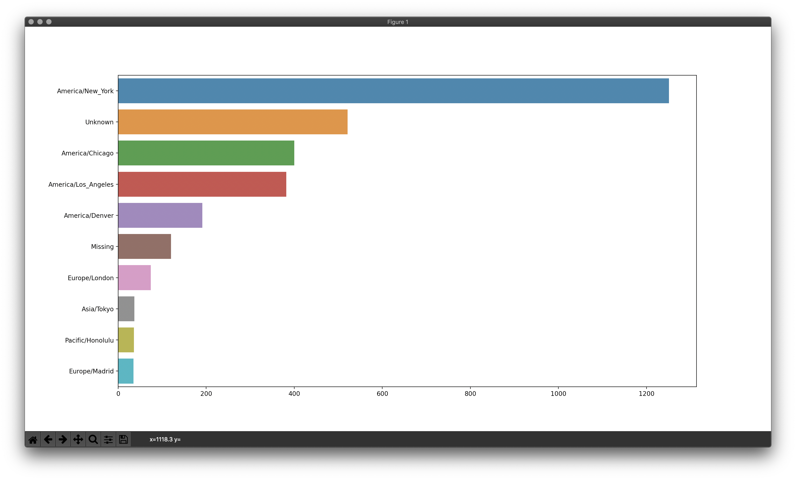

# 分析Bitly、USA.gov提供的縮短網址服務的使用者資料

## 1.python packages:
1. appdirs            1.4.4
2. certifi            2020.6.20
3. distlib            0.3.1
4. filelock           3.0.12
5. importlib-metadata 1.7.0
6. pip                20.2.3
7. pipenv             2020.8.13
8. setuptools         50.3.0
9. six                1.15.0
10. virtualenv         20.0.31
11. virtualenv-clone   0.5.4
12. wheel              0.35.1
13. zipp               3.1.0

## 2.pandas 資料整理

建立Dataframe

## 3.matplotlib 視覺化

1.usa.gov 樣本資料中出現頻率最高之時區
